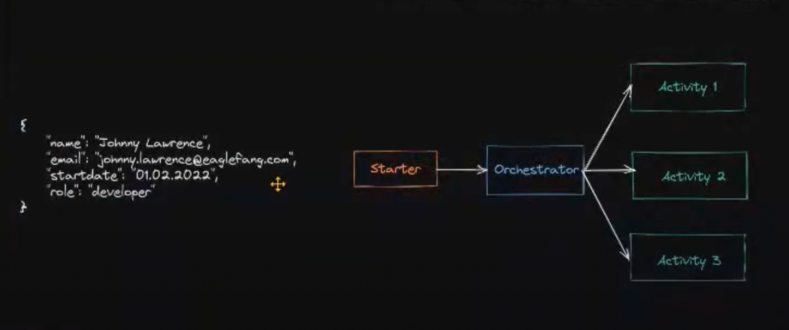
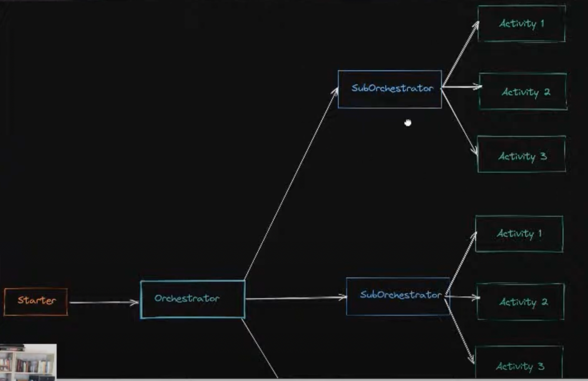

#  Azure Durable Functions - Advanced Patterns (TypeScript)

- [Notes to the Lesson](https://github.com/marcduiker/azure-functions-university/blob/main/lessons/typescript/durable-functions/advanced/README.md)
- [Video to the Lesson](https://www.youtube.com/watch?v=iYij7Mf7_dE)
- [The Durable Functions Monitor tool](https://github.com/microsoft/DurableFunctionsMonitor/wiki)

1. Fan-Out/Fan-In

2. Sub-Orchestration

3. External Event - Human Interaction